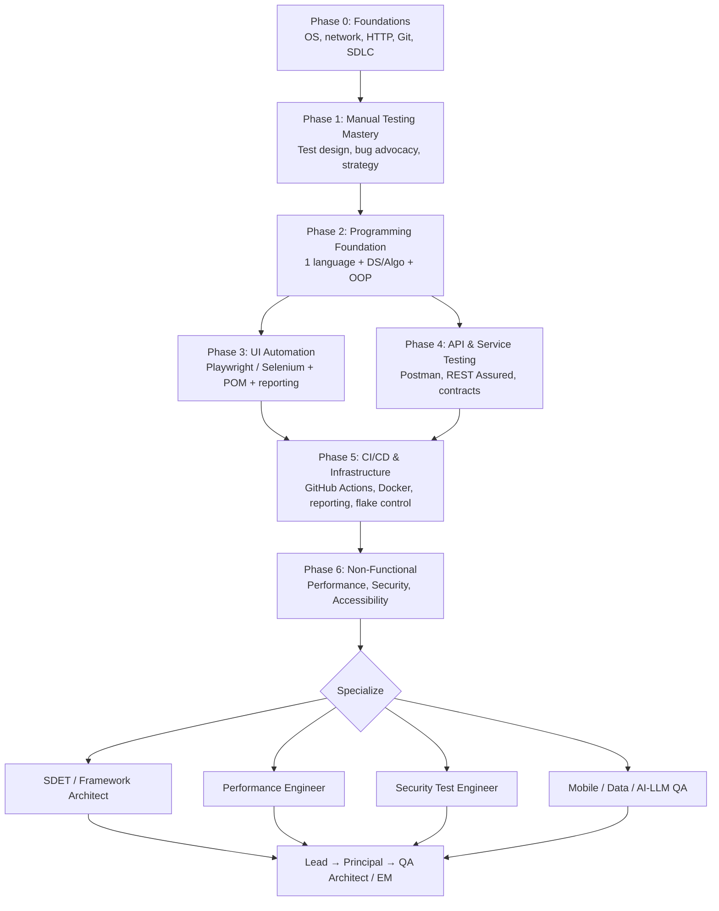

---

**💡 Tip:** SQA is not just about finding bugs — it’s about understanding the product, improving quality, and delivering value to users.

---


# SQA Engineer RoadMap
* Technical skills
* Business acumen 
* Soft skills


### Technical skills 
1. Basics of programming language ( pick one language do it's basic, oop, problems)
2. Knowledge of source control git, GitHub 
3. Knowledge of database SQL,  (Joins, Functions)
4. Technology stack is used in application, able to read log files( able to read exception or errors ), understand stack trace or Test APIs
5.  Knowledge of cloud ( azure, , google cloud, AWS) and CI/CD tools ( Jenkins, azure DevOps TFS, Circle CI, GitHub action)
6. Knowledge of testing tools bug management , test case management ( TestRail, Jira)
7. Good command over automation practice 
8. Knowledge of Linux commands ( docs, Linux, bash)
9. Understand of mobile, web and api ( do self learning on all stacks)
10. Knowledge of NFRs ( Performance( tools, types), security ( top ten attacks on OS, solution, report), usability, accessibility( special people))
11. Knowledge of software development process ( TDD,BDD(Given Then, When).

#### Automation ( Arrangements (finding the locators and writing in POM/BDD )and , Action, Assertion ( verify the action))
- Learn basics of programming language ( pick one language do it's basic, oop, problems hacker rank) string reverse, integer reverse, prime number, string palindrome, Hacker rank basic, intermediate problem solving certification ( daily one program)
- Learn DB queries on hacker rank 
- Focus on the following tools
 1. Selenium WebDriver with java for web automation 
 2. Appium with java for mobile automation 
 3. Rest assured for API automation 


#### Tools 
- Google page speed insight/ gtmatrix for performance 
- BURP/ Acunetix / ZAP for security testing 
- Selenium/ cypress/ playwright for web ui automation 
- Postman/ rest assured for API automation 
- Appium/ espresso for mobile automation 
- JMeeter/ load runner for load and stress testing 
- Applitools eyes / sikuli for automated visual testing 
- Cucumber/ specFlow  for knowledge of BDD 
- Test comple/ ranorex /QTP QFT
- TestRail / Zephyr for test case management 
- Jira/ azure/ Bugzilla for bug management 
- Jenkins/ bamboo/ aws/ azure DevOps for CI/CD 

#### Business acumen ( Domain knowledge)
1. Have customer prospective 
2. Asking and understanding what problem of the customer does the feature solve. 
3. Asking what and why?
4. Understanding risks and opportunities 
5. Can become expert in a domain in less time (flexible)
6. Only then you can uncover the scenarios
Also check the compatible apps for getting more projects knowledge 
##### Example 
* Doctor or patient app 
* POS keyboard friendly ( super market )
* POS touch screen in restaurants 

#### Soft skills 
1. Communication ( written, verbal, listening) more listen speak less. 
2. Empathy or positive attitude 
3. Emotional Intelligence ( how to get along and how to handle bullies) 
4. Eager to learn and Share 
5. Time management 
6. Leadership 
7. Being coachable

#### How to develop those skills 
1. Learn everyday 
2. Read everyday ( ministry of testing, software testinghelp.com, Guru99.com, toolSQA.com)
3. Do online courses ( TAU, Udemy, Lambda test ) 
4. YouTube ( automation step by step, Naveen automation labs, Rahul Shetty, execute automation, SDET) 
5. Internship in good project based companies 
6. Attend meetups and sessions 
7. Follow experts on LinkedIn or Twitter 
8. Participate in open source project 
9. Freelancing 

#### Careers 
1. Management Track ( associate SQA, SQA, Senior SQA, Lead SQA, Manager SQA Senior Manager SQA, Associate Director, Director, VP) 
2. Individual Contributor Tract 
* Automation 
* Performance 
* Security

<div align="center">

# 🧭 SQA Engineer RoadMap

**From "I test manually" → to a senior, high-earning Quality Engineer.**

A complete, opinionated path covering manual testing, automation, API, CI/CD, performance,
security, databases, cloud and the career moves that actually move your salary.


</div>

---

> 💡 **Core idea:** SQA is not about finding bugs. It is about understanding the product,
> reducing risk, and giving the business confidence to ship. People who find bugs get paid
> average. People who **prevent** risk and **build the systems** that find bugs get paid well.

---

## 📑 Table of Contents

| # | Section | What you get |
|---|---------|--------------|
| 1 | [Who This Roadmap Is For](#1-who-this-roadmap-is-for) | Honest entry points |
| 2 | [What Actually Pays in QA](#2-what-actually-pays-in-qa) | The salary levers, no fluff |
| 3 | [The Roadmap at a Glance](#3-the-roadmap-at-a-glance) | Visual path + level map |
| 4 | [Phase 0 — Foundations](#phase-0--foundations-weeks-14) | CS basics, tooling, mindset |
| 5 | [Phase 1 — Manual Testing Mastery](#phase-1--manual-testing-mastery-months-13) | Test design that seniors respect |
| 6 | [Phase 2 — Programming Foundation](#phase-2--programming-foundation-months-24) | The gate most QAs never pass |
| 7 | [Phase 3 — UI Automation](#phase-3--ui-automation-months-46) | Framework, not scripts |
| 8 | [Phase 4 — API & Service Testing](#phase-4--api--service-testing-months-56) | Where the real bugs live |
| 9 | [Phase 5 — CI/CD & Infrastructure](#phase-5--cicd--infrastructure-months-68) | Turning tests into a pipeline |
| 10 | [Phase 6 — Non-Functional Testing](#phase-6--non-functional-testing-months-812) | Performance, security, accessibility |
| 11 | [Databases & SQL for Testers](#databases--sql-for-testers) | Full beginner → advanced track |
| 12 | [Specialization Tracks](#-specialization-tracks-choose-after-month-12) | Where the money concentrates |
| 13 | [Portfolio Projects](#-portfolio-projects-that-get-interviews) | 6 projects that prove skill |
| 14 | [Interview Preparation](#-interview-preparation) | Question banks + STAR stories |
| 15 | [Career Ladder & Salary Strategy](#-career-ladder--salary-strategy) | Titles, levers, negotiation |
| 16 | [12-Month Execution Plan](#-12-month-execution-plan) | Week-by-week discipline |
| 17 | [Tools, Resources & Practice Sites](#-tools-resources--practice-sites) | Curated, not a dump |
| 18 | [Repo Contents](#-repo-contents) | What else is in here |

---

## 1. Who This Roadmap Is For

| You are… | Start here | Realistic timeline |
|---|---|---|
| Fresh graduate / career switcher | [Phase 0](#phase-0--foundations-weeks-14) | 12–18 months to solid mid-level |
| Manual QA with 1–3 years, no code | [Phase 2](#phase-2--programming-foundation-months-24) | 9–12 months to SDET-capable |
| Automation QA who only writes scripts | [Phase 3](#phase-3--ui-automation-months-46) + [Phase 5](#phase-5--cicd--infrastructure-months-68) | 6–9 months to senior signal |
| Senior QA hitting a salary ceiling | [Specializations](#-specialization-tracks-choose-after-month-12) + [Salary Strategy](#-career-ladder--salary-strategy) | 6 months to reposition |

**Prerequisite honesty check:** This roadmap assumes 1.5–3 focused hours per day, 5–6 days a
week. Less than that is fine — just multiply the timelines. Consistency beats intensity.

---

## 2. What Actually Pays in QA

Most QA engineers plateau because they keep getting *deeper* at the same level of value
instead of moving *up* the value chain. Here is the chain:

```
Level 1  │ Executes test cases someone else wrote          │ Lowest pay, highest replacement risk
Level 2  │ Designs test cases from requirements            │ Baseline professional
Level 3  │ Automates their own tests                       │ Market average
Level 4  │ Builds & owns the automation framework          │ Above market  ← most people stop short
Level 5  │ Owns quality in the delivery pipeline (CI/CD)   │ Strong senior/SDET pay
Level 6  │ Prevents defects: architecture, risk, strategy  │ Lead / Principal / QA Architect
Level 7  │ Scarce specialization (perf, security, ML/AI)   │ Top of the band
```

### The six real salary levers

| Lever | Why it pays | How to pull it |
|---|---|---|
| **Code ability** | Removes the QA/dev pay wall | One language, deeply. OOP + data structures + clean code |
| **Framework ownership** | You become infrastructure, not labour | Build, document and maintain a framework others use |
| **Pipeline ownership** | Quality gates = business risk control | Own CI/CD test stages, flakiness, reporting |
| **Scarce specialization** | Small supply, urgent demand | Performance, security, mobile, data/ETL, AI/LLM testing |
| **Domain depth** | Domain bugs cost the most money | Fintech, healthcare, legal-tech, telecom, e-commerce |
| **Communication & influence** | Decides who gets promoted | Written clarity, stakeholder reporting, mentoring |

### Uncomfortable truths worth internalizing

1. **Certifications do not raise salary much.** They open HR filters. Projects raise salary.
2. **Tool count ≠ skill.** "Knows 15 tools" loses to "shipped one framework used by 12 people".
3. **Manual-only roles are compressing.** Manual *thinking* is more valuable than ever; manual
   *execution* as a full-time job is shrinking. Keep the thinking, automate the execution.
4. **Remote/international work is the single biggest multiplier** for engineers in lower-cost
   markets — usually far bigger than any local promotion. Build a public, English-documented
   GitHub portfolio with that in mind.
5. **Verify real numbers, don't trust roadmap blogs.** Check Levels.fyi, Glassdoor, local salary
   surveys, and — most reliably — talk to recruiters in your market once every quarter.

---

## 3. The Roadmap at a Glance



### Level map — what "good" looks like at each stage

| Stage | Title equivalent | Can do independently | Proof artifact |
|---|---|---|---|
| **S0** | Trainee / Intern | Execute cases, log clean bugs | 50 well-written test cases |
| **S1** | QA Engineer (Junior) | Design cases from requirements, run regression | Test plan + RTM for a real app |
| **S2** | QA Engineer (Mid) | Automate own suite, query DB, test APIs | UI + API suite in GitHub |
| **S3** | Senior QA / SDET | Build framework, own CI pipeline, mentor | Framework repo with docs + CI badge |
| **S4** | Lead / Staff | Test strategy, risk model, tool selection, metrics | Quality strategy doc + dashboards |
| **S5** | Principal / Architect | Org-wide quality architecture, shift-left programs | Rewritten testing practice, measurable outcomes |

---

# 🏗️ The Detailed Path

Each phase lists **Learn → Practice → Prove**. Do not move on until you have the *Prove* artifact.
That artifact is what you show in an interview; notes alone convince nobody.

---

## Phase 0 — Foundations (Weeks 1–4)

You cannot test a system you don't understand. This phase is short but non-negotiable.

### Learn

- **Software development lifecycle** — Waterfall, V-Model, Agile/Scrum, Kanban, and where
  testing sits in each. Scrum ceremonies: refinement, planning, standup, review, retro.
- **How the web works** — DNS → TCP → HTTP(S) request/response, status codes, headers, cookies,
  sessions, caching, CORS, REST vs SOAP vs GraphQL.
- **Client–server & architecture basics** — monolith vs microservices, load balancers, queues,
  databases, CDNs, what "the environment" means (DEV / QA / UAT / Staging / Prod).
- **Operating systems & CLI** — file systems, processes, services, environment variables.
  Linux commands: `cd ls cat grep tail -f find chmod ps kill curl ssh scp df top`.
- **Reading logs** — application logs, stack traces, exception vs error, correlation IDs,
  browser DevTools (Console, Network, Application, Performance tabs).
- **Git & GitHub** — `init clone add commit push pull branch merge`, `.gitignore`, pull requests.

### Practice

- Open DevTools on any site you use. For 10 actions, record the API call, method, payload,
  status code and response time.
- Break something on purpose: disconnect the network mid-request, send a malformed input,
  clear a cookie mid-session. Observe how the app behaves.
- `tail -f` a log file while using an app and match log lines to your UI actions.

### Prove

✅ A GitHub repo with a `notes/` folder documenting HTTP status codes, a DevTools walkthrough
with screenshots, and a cheat sheet of 30 Linux commands you actually used.

---

## Phase 1 — Manual Testing Mastery (Months 1–3)

This is where most people go too fast. Deep test design is the skill that separates a tester
from a button-clicker — and it is the skill automation *cannot* replace.

### 1.1 Testing fundamentals

- The 7 testing principles (defect clustering, pesticide paradox, absence-of-errors fallacy…)
- Verification vs validation · QA vs QC vs Testing
- Static testing: requirement reviews, walkthroughs, inspections
- Test levels: unit → integration → system → acceptance (UAT)
- Test types: functional, regression, smoke, sanity, retesting, exploratory, ad-hoc,
  compatibility, usability, localization/globalization, accessibility, recovery, install/upgrade

### 1.2 Test design techniques (memorize and *apply* these)

| Technique | Use when | Example |
|---|---|---|
| Equivalence Partitioning | Input has ranges/classes | Age 0–17, 18–64, 65+ |
| Boundary Value Analysis | Any numeric/length limit | min-1, min, min+1, max-1, max, max+1 |
| Decision Table | Multiple conditions combine | Discount = f(member, cart total, coupon) |
| State Transition | Object has states | Order: draft → paid → shipped → returned |
| Pairwise / Orthogonal Array | Config explosion | 5 browsers × 4 OS × 3 roles |
| Use Case / Scenario | End-to-end flows | Checkout with saved card + promo |
| Error Guessing | Experience-driven | Null, emoji, SQL quote, 10k characters, leading spaces |
| Exploratory (charter-based) | Unclear/changing requirements | 90-min timeboxed session + session notes |

### 1.3 Documentation that seniors respect

- **Test plan** — scope, in/out, approach, environments, entry/exit criteria, risks, schedule
- **Test strategy** — the *why* behind the approach, organization-level
- **Test case** — ID, title, preconditions, steps, test data, expected result, priority
- **RTM (Requirement Traceability Matrix)** — requirement ↔ test case ↔ defect coverage
- **Bug report** — title formula: `[Module] What fails when doing X under Y condition`
  Body: environment, build, preconditions, steps, expected, actual, evidence (screenshot/video/
  log/HAR), severity, priority, regression or new
- **Test summary report** — executed/passed/failed/blocked, defect density, open risks, go/no-go

### 1.4 Bug advocacy (the underrated skill)

A bug that gets closed as "Won't Fix" because you argued it badly is a bug you didn't find.
Learn to describe **user impact and business risk**, not just the broken pixel. Quantify:
how many users, how often, is there a workaround, what does it cost?

### 1.5 Agile & process

Story refinement, acceptance criteria in Given/When/Then, definition of ready/done,
estimation, sprint test scope, shift-left testing, the test pyramid vs the ice-cream cone.

### Practice

- Take a real app (see [practice sites](#-tools-resources--practice-sites)). Write **40+ test
  cases** for one module using at least 4 different design techniques.
- Run a 90-minute charter-based exploratory session. Write the session notes and 5 real bugs.
- Build an RTM for 10 requirements.

### Prove

✅ A public repo: `qa-portfolio/manual-testing/` containing a test plan, 40+ test cases in a
spreadsheet, an RTM, and 10 professional bug reports with evidence.

---

## Phase 2 — Programming Foundation (Months 2–4)

**This phase is the gate.** Almost every QA salary ceiling is a coding ceiling. Pick **one**
language and go deep — switching languages every month is the most common wasted year in QA.

### Pick one

| Language | Best for | Ecosystem |
|---|---|---|
| **Java** | Enterprise, Selenium/REST Assured shops, biggest QA job market | TestNG, JUnit 5, Maven/Gradle, Rest Assured, Appium |
| **JavaScript / TypeScript** | Modern web teams, fastest ramp with Playwright/Cypress | Playwright, Cypress, Jest, Supertest, k6 |
| **Python** | Data/ETL, API-heavy, AI-adjacent QA, scripting | pytest, requests, Playwright-Python, Locust |
| **C#** | .NET / Microsoft stack shops | NUnit, SpecFlow/Reqnroll, Playwright .NET |

### Learn (language-agnostic checklist)

- Syntax, variables, types, operators, control flow
- Strings (manipulation, formatting, regex basics), arrays/lists
- Collections: List, Set, Map/Dictionary, Queue, Stack — and when to use each
- **OOP**: class vs object, encapsulation, inheritance, polymorphism, abstraction, interfaces,
  composition-over-inheritance, static vs instance, access modifiers
- Exception handling, custom exceptions, try/catch/finally, resource cleanup
- File I/O, JSON/XML/CSV parsing
- Functional features (streams/lambdas/comprehensions)
- Unit testing framework of the language + assertions + mocking basics
- Clean code: naming, single responsibility, DRY, small functions, no magic strings
- Build tools & dependency management (Maven/Gradle, npm/pnpm, pip/poetry, NuGet)

### Data structures & algorithms — the realistic scope

You are not interviewing at a FAANG algorithms bar. You need **comfort, not competition level**:
arrays, strings, hash maps, sets, stacks, queues, two pointers, sorting, searching, recursion
basics, and Big-O intuition.

### Practice routine (daily, 45–60 min)

1. One problem per day: HackerRank → LeetCode Easy → LeetCode Medium
2. Classic warm-ups: reverse a string, palindrome, prime check, FizzBuzz, anagram, duplicate
   finder, word frequency count, two-sum, first non-repeating character, matrix traversal
3. Write small **utilities you'll actually reuse**: a JSON reader, an Excel/CSV data provider,
   a random test-data generator, a date helper, a log parser

### Prove

✅ 50+ solved problems pushed to GitHub with clean commits, **plus** a small `test-utils`
library you wrote yourself (data generator + config reader + file utils) with unit tests.

---

## Phase 3 — UI Automation (Months 4–6)

The goal is **not** "I can write a Selenium script." The goal is **"I designed a framework a
team can use and maintain."** That distinction is worth a whole pay grade.

### Choose your driver

| Tool | Strengths | Choose when |
|---|---|---|
| **Playwright** | Auto-wait, fast, multi-browser, trace viewer, great API testing built in | New projects, modern stacks — best default in 2026 |
| **Selenium WebDriver** | Industry standard, huge job market, language-agnostic, grid | Enterprise/legacy shops, most job ads still say Selenium |
| **Cypress** | Superb DX, time-travel debugging | Front-end heavy teams, JS-only |

> 💡 Learn **one deeply + one conversationally**. Playwright + Selenium is the strongest combo
> for employability.

### 3.1 Core automation skills

- Locator strategy: ID → name → CSS → XPath → role/text-based locators. Locator *stability*
  beats locator cleverness. Push your team toward `data-testid`.
- The three A's of every test: **Arrange** (locators, data, state) → **Act** → **Assert**
- Waits: implicit vs explicit vs fluent; auto-waiting; why `Thread.sleep()` is technical debt
- Handling: dropdowns, checkboxes, radios, alerts, frames/iframes, multiple windows/tabs,
  file upload/download, drag-and-drop, shadow DOM, hover, keyboard actions, scrolling
- Browser context, cookies, localStorage, storage state for **login-once** authentication
- Network interception & mocking, request stubbing, simulating failures and slow networks
- Screenshots, videos, traces, and full failure diagnostics

### 3.2 Framework design (this is the real skill)

```
framework/
├── config/            # env configs, capabilities, timeouts (never hardcode)
├── pages/             # Page Object Model classes — no assertions here
├── components/        # reusable widgets (nav bar, date picker, grid)
├── tests/             # test classes — assertions live here
├── data/              # JSON/CSV/Excel test data
├── utils/             # driver factory, waits, API helpers, DB helpers, logger
├── reports/           # Allure / Extent output
└── .github/workflows/ # CI pipeline
```

- **Design patterns**: Page Object Model, Page Factory, Singleton (driver), Factory (browser),
  Builder (test data), Strategy (environments), Fluent interfaces
- **Test runners**: TestNG / JUnit 5 / pytest / Playwright Test — annotations, groups, tags,
  priorities, dependencies, retries, parallel execution, data providers
- **Data-driven & parameterized** testing from JSON/CSV/Excel/DB
- **BDD** with Cucumber / SpecFlow / Reqnroll: Feature files, Given-When-Then, step definitions,
  hooks, tags, and an honest view of when BDD is worth its overhead (hint: only when
  non-technical stakeholders actually read the features)
- **Reporting**: Allure or Extent Reports with screenshots on failure, plus CI-published HTML
- **Logging**: structured logs (Log4j2/SLF4J/winston) so failures are diagnosable without rerun
- **Parallel execution**: thread-safe drivers (ThreadLocal), isolated test data, no shared state
- **Cross-browser & grid**: Selenium Grid, Docker Grid, cloud grids (BrowserStack/LambdaTest)
- **Flaky test management**: root-cause categories (timing, data, environment, test coupling,
  app instability), quarantine strategy, retry-with-reporting, flake dashboards

### 3.3 Visual & accessibility automation

- Visual regression: Playwright snapshots, Applitools, Percy
- Accessibility: axe-core integration, WCAG 2.2 AA basics, keyboard-only navigation,
  screen-reader smoke checks

### Prove

✅ A public framework repo with: POM structure, 25+ stable tests, config-driven environments,
parallel execution, Allure report published by CI, a README with architecture diagram, and a
60-second Loom video explaining your design decisions.

---

## Phase 4 — API & Service Testing (Months 5–6)

More critical bugs live under the UI than in it, and API tests are 10× faster and 10× more
stable. This is the highest return-on-effort skill in QA.

### 4.1 Fundamentals

- REST principles, resources, idempotency, statelessness
- HTTP methods: GET / POST / PUT / PATCH / DELETE / HEAD / OPTIONS
- Status codes and what they *should* mean (200 vs 201 vs 202 vs 204; 400 vs 401 vs 403 vs 404
  vs 409 vs 422 vs 429; 500 vs 502 vs 503 vs 504)
- Headers, content negotiation, pagination, filtering, sorting, versioning, rate limiting
- Payloads: JSON, XML, form-data, multipart; JSON Schema
- Auth: Basic, API key, Bearer/JWT (decode and validate claims!), OAuth 2.0 flows, session cookies
- GraphQL basics (queries, mutations, over/under-fetching) and gRPC awareness
- Async/event-driven: webhooks, message queues (Kafka/RabbitMQ), eventual consistency testing

### 4.2 Tooling ladder

1. **Postman / Bruno / Insomnia** — collections, environments, variables, pre-request and test
   scripts, chaining requests, data-driven runs, collection runner, mock servers, monitors
2. **Newman / Postman CLI** — run collections in CI, publish reports
3. **Code-level API frameworks** — REST Assured (Java), Supertest/Playwright APIRequest (JS),
   requests + pytest (Python), RestSharp (C#). This is the step that makes you an SDET.
4. **Contract testing** — Pact / consumer-driven contracts, OpenAPI/Swagger validation
5. **Service virtualization** — WireMock, MockServer, Prism for unavailable dependencies

### 4.3 What to actually test

- Happy path + status/schema/headers/response-time assertions
- Negative: missing fields, wrong types, extra fields, nulls, empty arrays, huge payloads,
  invalid IDs, unauthorized, expired tokens, wrong role
- Boundary: pagination edges, max lengths, numeric limits, unicode and emoji
- Business logic chains: create → read → update → delete → verify in DB
- Idempotency, duplicate submissions, race conditions, concurrency
- Backward compatibility across versions

### Prove

✅ An API automation repo: 40+ tests over a public API (or your own), schema validation, auth
handling, environment configs, data-driven cases, chained workflows, HTML report, running on CI.

---

## Phase 5 — CI/CD & Infrastructure (Months 6–8)

Automation that only runs on your laptop is a hobby. Automation that gates a deployment is
**infrastructure** — and infrastructure owners get paid like engineers.

### Learn

- CI vs CD (delivery) vs CD (deployment); build → test → package → deploy → verify
- **Pick one platform deeply**: GitHub Actions (easiest to showcase publicly), Azure Pipelines,
  Jenkins (most common in enterprises), GitLab CI
- Pipeline as code: YAML syntax, jobs, steps, matrices, reusable workflows, composite actions
- Triggers: push, PR, schedule (nightly regression), manual dispatch, webhooks
- Agents/runners, self-hosted runners, caching dependencies, artifacts, retention
- Test stages & quality gates: smoke on every PR, full regression nightly, fail-the-build rules
- Publishing results: JUnit XML, Allure, HTML report hosting (GitHub Pages), PR comments
- Secrets management: never in code; vaults, masked variables, least privilege
- **Docker**: images vs containers, Dockerfile, docker-compose, running your test suite and its
  dependencies (DB, mock server, Selenium Grid) in containers
- **Kubernetes awareness**: pods, deployments, services, `kubectl logs/describe` for debugging
- Environments & test data: seeding, cleanup, isolation, parallel-safe data strategy
- Notifications: Slack/Teams/email on failure, with a link to the failing report
- Basic observability: reading Application Insights / Datadog / Grafana / ELK during testing
- Shift-left: pre-commit hooks, lint, unit tests on PR; shift-right: canary, feature flags,
  synthetic monitoring, testing in production safely

### Prove

✅ Your UI + API repos both run on CI with a green badge in the README, artifacts published,
a nightly scheduled run, a Dockerfile, and Slack/Teams notification wired up.

---

## Phase 6 — Non-Functional Testing (Months 8–12)

This is where specialization — and the biggest pay jumps — begin.

### 6.1 Performance Testing

**Concepts:** load vs stress vs spike vs soak/endurance vs scalability vs volume testing;
throughput, latency percentiles (p50/p90/p95/p99 — averages lie), concurrency vs users,
think time, pacing, ramp-up, steady state, saturation point, Little's Law, Apdex.

**Process:** define NFRs and SLAs → model realistic workload → script → parameterize/correlate →
baseline → execute → monitor (CPU, memory, GC, DB, threads, I/O) → analyze bottleneck →
report with recommendations → retest.

**Tools:** JMeter (industry standard), k6 (developer-friendly, JS), Gatling (Scala/Java),
Locust (Python), plus Grafana + InfluxDB for live dashboards, and browser-side: Lighthouse,
PageSpeed Insights, WebPageTest, Core Web Vitals (LCP, INP, CLS).

**JMeter specifics:** thread groups, samplers, config elements (CSV Data Set, HTTP Defaults,
Header Manager), pre/post-processors, extractors (Regex, JSON, XPath, Boundary), assertions,
timers, controllers (If, Loop, Transaction, Throughput), listeners, non-GUI execution
(`jmeter -n -t plan.jmx -l results.jtl -e -o report/`), distributed/master-slave testing,
heap tuning, and CI integration with performance gates.

**Analysis skill that pays:** don't just report "response time was 3.2s" — report *where* the
time went and *what* to fix (N+1 query, missing index, thread pool exhaustion, GC pressure,
chatty API, no caching, connection pool limits).

### 6.2 Security Testing

**Fundamentals:** CIA triad, authentication vs authorization, encryption vs hashing vs
encoding, TLS/certificates, secure headers (CSP, HSTS, X-Frame-Options), same-origin policy,
CORS, secrets hygiene, threat modeling (STRIDE).

**OWASP Top 10 (2021, with 2025 awareness):**
A01 Broken Access Control · A02 Cryptographic Failures · A03 Injection (SQLi, NoSQLi, command,
LDAP) · A04 Insecure Design · A05 Security Misconfiguration · A06 Vulnerable & Outdated
Components · A07 Identification & Authentication Failures · A08 Software & Data Integrity
Failures · A09 Security Logging & Monitoring Failures · A10 Server-Side Request Forgery.
Also study the **OWASP API Security Top 10** — BOLA/IDOR is the #1 API bug in the wild.

**Practical test cases every QA should run:** IDOR (change the ID in the URL/payload to another
user's), privilege escalation (call an admin endpoint with a user token), missing function-level
auth, JWT tampering (alg=none, expired, modified claims), session fixation/timeout, password
policy and reset-token reuse, rate limiting and brute force, XSS (stored/reflected/DOM),
CSRF, open redirect, file-upload type/size bypass, verbose error leakage, directory listing.

**Tools:** OWASP ZAP (start here — free and automatable), Burp Suite Community, Nikto, sqlmap,
Nmap, `testssl.sh`, dependency scanning (OWASP Dependency-Check, Snyk, `npm audit`),
SAST/DAST/SCA in the pipeline, Trivy for container scanning.

> ⚠️ **Only test systems you are authorized to test.** Use deliberately vulnerable labs:
> OWASP Juice Shop, DVWA, WebGoat, PortSwigger Web Security Academy (free and excellent),
> HackTheBox / TryHackMe.

### 6.3 Accessibility & Compliance

WCAG 2.2 A/AA criteria, POUR principles, semantic HTML and ARIA, keyboard-only navigation,
focus management, color contrast, screen readers (NVDA, VoiceOver), axe DevTools, Lighthouse,
WAVE, and legal drivers (ADA, Section 508, EN 301 549, European Accessibility Act).
Compliance awareness: GDPR, PCI-DSS, HIPAA, SOC 2 — knowing *what evidence auditors want*
from QA makes you valuable in regulated domains.

### 6.4 Other non-functional areas

Usability, compatibility (browser/device/OS matrix), localization & internationalization
(RTL languages, date/number/currency formats, text expansion), reliability/resilience
(chaos engineering basics, failover, retry/timeout behaviour), installability and upgrade
testing, backup/recovery, and disaster recovery drills.

### Prove

✅ A performance test report (JMeter or k6) with workload model, percentile graphs, identified
bottleneck and recommendations; **plus** a ZAP baseline scan report on Juice Shop with 5
manually verified findings, impact and remediation written up.

---

## Databases & SQL for Testers

Data bugs are silent and expensive. Every serious QA can open a database and verify the truth
behind the UI.

### Beginner

- RDBMS concepts: tables, rows, columns, schemas, primary/foreign keys, constraints, indexes,
  data types, NULL semantics, normalization (1NF–3NF)
- `SELECT`, `WHERE`, `ORDER BY`, `GROUP BY`, `HAVING`, `DISTINCT`, `LIMIT/TOP`, aliases
- Aggregates: `COUNT SUM AVG MIN MAX`
- DML: `INSERT`, `UPDATE`, `DELETE` — and always `SELECT` your `WHERE` clause first

### Intermediate

- Joins: INNER, LEFT, RIGHT, FULL OUTER, CROSS, SELF — and knowing *why* a LEFT JOIN row is NULL
- Subqueries, correlated subqueries, `EXISTS` vs `IN` vs `JOIN`
- `CASE`, `COALESCE`, `NULLIF`, string/date functions, `LIKE`, `BETWEEN`, set operations
  (`UNION`, `UNION ALL`, `INTERSECT`, `EXCEPT`)
- Testing scenarios: data integrity, referential integrity, constraint validation, CRUD
  verification after UI actions, duplicate detection, orphan records, data-type/truncation bugs

### Advanced

- CTEs and recursive CTEs, window functions (`ROW_NUMBER`, `RANK`, `LAG/LEAD`, running totals)
- Transactions and ACID, isolation levels, dirty/non-repeatable/phantom reads, deadlocks
- Stored procedures, functions, triggers, views — and how to test them
- Execution plans, index usage, query tuning, why your test just timed out
- ETL/data-pipeline testing: source-to-target mapping, row counts, checksums, transformation
  rules, SCD handling, late-arriving data, reconciliation
- NoSQL awareness: MongoDB queries, Redis, and when schema-less bites you
- DB automation: JDBC/pyodbc/pg drivers inside your test framework for setup, verification
  and teardown

### Prove

✅ 30 solved SQL problems (HackerRank/LeetCode/StrataScratch) + a test suite where at least
10 UI/API tests verify their result **in the database**.

---

## 🤖 AI in QA (Don't Skip This)

In 2026, "can you use AI effectively" is a salary lever, not a novelty. Two directions:

### A. Using AI to test better

- Generating test case drafts, edge-case brainstorms and test data from requirements
- Converting acceptance criteria into Gherkin scenarios and skeleton automation
- Explaining stack traces, failed pipelines and unfamiliar codebases fast
- Self-healing locators, visual AI (Applitools), flaky-test triage assistants
- Summarizing defect trends and writing stakeholder reports

**Rule:** AI drafts, **you verify**. Shipping unverified AI output is how testers lose trust.

### B. Testing AI/LLM systems (a scarce, well-paid niche)

- Non-determinism: how do you assert on a system that answers differently each run?
- Evaluation techniques: golden datasets, rubric/LLM-as-judge scoring, human eval loops,
  regression suites for prompts, semantic similarity assertions
- Quality dimensions: factual accuracy, hallucination rate, grounding/citation correctness,
  relevance, tone, latency, cost per request, token limits
- Safety & red-teaming: prompt injection, jailbreaks, data leakage, PII handling, bias testing
- RAG-specific testing: retrieval precision/recall, chunking, context-window failures, stale index
- Guardrails, fallbacks, and monitoring in production

Learning this now puts you in a small pool with rising demand.

---

## 🎯 Specialization Tracks (choose after Month 12)

Generalists get jobs. Specialists get paid. Pick **one primary** and one supporting track.

| Track | What you own | Core stack | Why it pays |
|---|---|---|---|
| **SDET / Framework Architect** | Test frameworks, tooling, dev experience | Java/TS, Playwright/Selenium, CI, Docker | Closest to a developer role; strongest ladder |
| **Performance Engineer** | Capacity, scalability, SLAs | JMeter/k6/Gatling, Grafana, APM, profiling | Few people can analyze bottlenecks properly |
| **Security Test Engineer** | AppSec verification, pen-test support | ZAP, Burp, SAST/DAST, OWASP | Regulatory pressure + skill scarcity |
| **Mobile QA / Automation** | iOS + Android quality | Appium, XCUITest, Espresso, device farms | Device complexity keeps supply low |
| **Data / ETL / BI QA** | Pipeline and warehouse correctness | SQL, Python, Airflow, dbt, Spark | Data teams are under-tested and well-funded |
| **AI / LLM QA** | Model & RAG quality, evals, red-teaming | Python, eval frameworks, prompt testing | New, scarce, growing fast |
| **QA Lead / Manager** | Strategy, people, process, metrics | Everything above + communication | Different ladder; pays on scope, not tools |
| **DevOps-leaning QE** | Pipelines, environments, observability | K8s, Terraform, Docker, cloud | Highest overlap with platform salaries |

---

## 💼 Portfolio Projects That Get Interviews

Six projects, in order. Each one should be a **separate public repo with a serious README**,
a CI badge, screenshots/GIFs, and a short "design decisions" section.

| # | Project | Demonstrates |
|---|---|---|
| 1 | **Manual testing pack** for a real app — test plan, 40+ cases, RTM, 10 bug reports, summary report | Test design maturity |
| 2 | **UI automation framework** — POM, config-driven, parallel, Allure report, CI | Engineering ability |
| 3 | **API automation suite** — schema validation, auth, chained flows, data-driven, CI | The highest-value automation skill |
| 4 | **End-to-end pipeline** — Dockerized suite, GitHub Actions, nightly regression, Slack alerts, GitHub Pages report | Ownership of quality gates |
| 5 | **Performance test** — workload model, JMeter/k6 scripts, dashboards, bottleneck analysis report | Specialization signal |
| 6 | **Security assessment** — ZAP automation + manual findings on Juice Shop, with impact and fixes | Rare in QA portfolios |

**README template for each project:** Problem → Approach → Architecture diagram → How to run →
Sample report → Key decisions and trade-offs → What I'd improve next.

> 🔑 One well-documented framework beats ten half-finished tutorial repos. Recruiters skim;
> engineers read your README and your commit history.

---

## 🎤 Interview Preparation

### The five rounds you should prepare separately

1. **Manual/fundamentals** — test design techniques, severity vs priority, STLC, bug lifecycle,
   how you'd test a given feature (e.g. "test a lift", "test WhatsApp voice notes")
2. **Coding** — 1–2 easy/medium problems, plus "write a function that…" in your language
3. **Automation/framework design** — explain your framework, why POM, how you handle waits,
   parallel runs, flakiness, test data, and reporting
4. **API/SQL live round** — write a query with joins/group-by; design API test cases; debug a 500
5. **Behavioral** — conflicts with developers, a bug you missed in production, pushing back on a
   deadline, mentoring, dealing with ambiguity

### Questions you must be able to answer crisply

- How do you decide what to automate and what stays manual?
- Your regression suite takes 4 hours and is 8% flaky. What do you do, in what order?
- A critical bug escaped to production. Walk me through your response and prevention plan.
- How do you test a feature with incomplete requirements?
- Explain the test pyramid and where your current project sits on it. Is that right?
- How do you manage test data across parallel runs and shared environments?
- What's your definition of done for a story?
- How do you measure whether your QA work is effective?

### STAR stories to prepare (write them out, 6–8 sentences each)

A production escape you owned · A time you prevented a major defect pre-release · A framework or
process you built from scratch · A disagreement with a developer or PM you resolved · A time you
had to say "not ready to ship" · A time you mentored someone.

### Metrics vocabulary (know what they mean *and* their limits)

Defect density · Defect leakage / escape rate · Defect removal efficiency (DRE) · Test coverage
(requirement, code, risk) · Mean time to detect / to repair · Flake rate · Automation pass rate ·
Cycle time · Change failure rate · DORA metrics. Be ready to explain why **test case count and
bug count are vanity metrics**.

---

## 📈 Career Ladder & Salary Strategy

### The two ladders

```
INDIVIDUAL CONTRIBUTOR                    MANAGEMENT
Trainee QA                                 —
QA Engineer                                —
Senior QA Engineer / SDET            →     QA Lead
Staff / Lead SDET                    →     QA Manager
Principal QE / QA Architect          →     Senior Manager → Director → VP Quality
```

Adjacent moves that often pay more than staying put: Business Analyst, Product Owner, Scrum
Master, DevOps/Platform Engineer, Developer, Solutions/Support Engineer, Consultant.
QA is one of the best launchpads in tech because you see the whole system.

### How to actually increase your compensation

1. **Change the work before you ask for the money.** Take on the framework, the pipeline, the
   performance testing — *then* renegotiate with evidence.
2. **Quantify your impact.** "Cut regression from 6 hours to 40 minutes", "caught 3 P1 defects
   pre-release", "reduced flake rate from 12% to 2%", "enabled daily releases". Keep a
   **brag document** updated weekly — you will not remember this at review time.
3. **Switching employers is usually the fastest raise.** Loyalty is rewarded with titles more
   often than money. Interview once a year even when happy — it calibrates your market value.
4. **Go where the money is.** Product companies > agencies. Regulated/high-risk domains
   (fintech, healthcare, legal, trading) > low-risk. Remote-international > local-only.
5. **Build public proof.** GitHub portfolio, LinkedIn posts about what you built, a blog,
   conference/meetup talks, open-source contributions to testing tools. Inbound offers beat
   applications.
6. **English and written communication** are compensation multipliers in every non-native market.
7. **Negotiate properly.** Never give the first number; ask for the band; get competing offers;
   negotiate total package (base, bonus, equity, leave, learning budget, remote allowance).

### Certifications — the honest ranking

| Certification | Verdict |
|---|---|
| **ISTQB Foundation** | Worth it early — common HR filter, teaches shared vocabulary |
| ISTQB Advanced (Test Analyst / TAE) | Optional; useful in enterprise/consulting markets |
| **Cloud fundamentals** (AZ-900 / AWS CCP) | Good ROI, signals infrastructure literacy |
| **Kubernetes / Docker certs** | Strong signal for DevOps-leaning QE |
| Security (Security+, eJPT, Burp Practitioner) | High value *if* going the security track |
| Vendor tool certs (Postman, Tricentis, etc.) | Low signal — nice-to-have only |
| **A great GitHub portfolio** | Beats all of the above, every time |

---

## 🗓️ 12-Month Execution Plan

Assumes ~2 hours/day. Adjust, don't abandon.

| Month | Primary focus | Secondary | Deliverable by month end |
|---|---|---|---|
| **1** | Testing fundamentals, SDLC, bug reporting | Git basics, DevTools | 40 test cases + 10 bug reports |
| **2** | Test design techniques, test plan, RTM | Programming syntax basics | Test plan + RTM + exploratory session notes |
| **3** | OOP + collections + exceptions | SQL beginner | 20 coding problems + 15 SQL queries |
| **4** | UI automation basics, locators, waits | SQL joins/subqueries | 10 stable automated tests |
| **5** | POM + framework structure + TestNG/pytest | Postman fundamentals | Framework skeleton + 20 tests |
| **6** | Reporting, data-driven, parallel execution | API assertions & auth | Framework v1 + Allure report |
| **7** | API automation in code (REST Assured/Playwright API) | Docker basics | API suite with 30 tests |
| **8** | CI/CD: GitHub Actions, artifacts, nightly runs | Test data strategy | Green CI badge on both repos |
| **9** | Performance testing (JMeter or k6) | Grafana dashboards | Load test + analysis report |
| **10** | Security testing (OWASP Top 10, ZAP, Juice Shop) | Dependency scanning | Security assessment report |
| **11** | Advanced SQL, DB verification in tests, flake control | Accessibility basics | DB-verified tests + flake dashboard |
| **12** | Portfolio polish, mock interviews, specialization pick | LinkedIn + résumé rewrite | 4 mock interviews + published portfolio |

### Daily template (2 hours)

```
0:00–0:45   Coding / SQL problem + review yesterday's solution
0:45–1:45   Project work (framework, pipeline, or current phase topic)
1:45–2:00   Write notes → push to GitHub → log what you learned
```

### Weekly rituals

- **Sunday review (30 min):** what shipped, what stalled, next week's single priority
- **Record a 60-second explanation** of what you built this week (interview practice)
- **Update the brag document** with one measurable outcome
- **Read one article + one piece of someone else's test code**

---

## 🧠 Soft Skills & Business Acumen

Technical skill gets you hired. These get you promoted.

### Communication

Clear bug reports · precise status updates · presenting test results to non-technical
stakeholders · escalating without blame · saying "we are not ready to ship" with data ·
writing documentation others actually read · listening more than you speak.

### Collaboration

Pairing with developers, participating properly in refinement (the cheapest bugs are the ones
you kill in a requirements conversation), cross-team coordination, knowledge sharing,
code reviews of test code, mentoring juniors.

### Analytical thinking

Root cause analysis (5 Whys, fishbone), risk identification and prioritization, pattern
recognition across defects, isolating variables, reproducing the irreproducible.

### Business acumen / domain knowledge

- Take the customer's perspective: what problem does this feature solve, for whom?
- Always ask **what** and **why** before **how**
- Learn the money flow of your domain — where a bug costs the most is where testing matters most
- Understand risk and opportunity, not just requirements
- Become domain-fluent fast: read the user docs, sit with support, listen to sales calls,
  shadow a real user for an hour

**Examples of domain thinking:** a doctor/patient app (privacy, dosage, audit trail) · a
supermarket POS (keyboard-only speed, barcode edge cases, offline mode) · a restaurant touch POS
(glove use, split bills, table transfers) · a legal document system (permissions, retention,
version integrity).

### How to keep developing

Learn every day · read every day · take structured courses · build in public · contribute to
open source · attend meetups and conferences · follow practitioners (not influencers) ·
teach what you learn — writing a tutorial is the fastest way to find your own gaps.

---

## 🧰 Tools, Resources & Practice Sites

### Tools worth real investment

| Category | Primary | Also know |
|---|---|---|
| UI automation | Playwright | Selenium WebDriver, Cypress |
| API | Postman + REST Assured / Playwright API | Bruno, Newman, WireMock, Pact |
| Mobile | Appium | Espresso, XCUITest, BrowserStack |
| Performance | JMeter | k6, Gatling, Locust, Lighthouse |
| Security | OWASP ZAP | Burp Suite, sqlmap, Snyk, Trivy |
| CI/CD | GitHub Actions | Jenkins, Azure Pipelines, GitLab CI |
| Containers | Docker | Kubernetes, docker-compose |
| Test management | Azure Test Plans / TestRail | Zephyr, Xray, Qase |
| Bug tracking | Jira / Azure DevOps | Bugzilla, Linear |
| Reporting | Allure | Extent Reports, ReportPortal |
| BDD | Cucumber | SpecFlow / Reqnroll, Behave |
| Databases | SQL Server / PostgreSQL / MySQL | MongoDB, Redis |
| Visual | Playwright snapshots | Applitools, Percy |
| Accessibility | axe DevTools | Lighthouse, WAVE, NVDA |

### Practice sites — UI automation & manual testing

- https://www.saucedemo.com/ — clean, stable, perfect first automation target
- https://the-internet.herokuapp.com/ — every tricky UI element in one place
- https://opensource-demo.orangehrmlive.com/ — realistic enterprise app with roles
- https://demowebshop.tricentis.com/ — e-commerce flows
- https://www.demoblaze.com/ — e-commerce with API behind it
- https://demo.opencart.com/ — full store + admin panel
- https://www.nopcommerce.com/en/demo — store + admin, good for permissions testing
- https://demoqa.com/ — element-by-element practice
- https://practice.expandtesting.com/ — modern practice suite

### Practice APIs

- https://reqres.in/ · https://jsonplaceholder.typicode.com/ · https://restful-api.dev/
- https://petstore.swagger.io/ (OpenAPI spec included) · https://gorest.co.in/
- https://api.github.com (real-world auth, pagination, rate limits)

### Security labs (authorized to attack)

- OWASP Juice Shop · DVWA · WebGoat · PortSwigger Web Security Academy · TryHackMe · HackTheBox

### Coding & SQL practice

- HackerRank (Problem Solving + SQL certificates) · LeetCode · Codewars · StrataScratch ·
  SQLZoo · SQLBolt · DB Fiddle

### Learning resources

**Docs first, always:** Playwright, Selenium, Postman Learning Center, JMeter, OWASP Testing
Guide, Git Book, k6 docs.

**Sites:** Ministry of Testing · Software Testing Help · Guru99 · ToolsQA · Test Automation
University (free, excellent) · Martin Fowler's testing articles.

**YouTube:** Automation Step by Step · Naveen AutomationLabs · Rahul Shetty Academy ·
ExecuteAutomation · SDET-QA · Testing Mini Bytes.

**Books:** *Lessons Learned in Software Testing* (Kaner/Bach/Pettichord) · *Agile Testing* and
*More Agile Testing* (Crispin & Gregory) · *Explore It!* (Elisabeth Hendrickson) ·
*The Art of Software Testing* (Myers) · *Clean Code* (Martin) · *Continuous Delivery*
(Humble & Farley) · *The Web Application Hacker's Handbook* (Stuttard & Pinto).

**Communities:** Ministry of Testing Club · r/QualityAssurance · Test Automation University
Slack · local QA meetups · LinkedIn testing community.

---

## ✅ Progress Checklists

### Year 1 — Junior → Mid
- [ ] Strong test design using 5+ techniques
- [ ] Professional bug reports and test documentation
- [ ] One programming language at a working level (50+ problems)
- [ ] Git/GitHub fluency with clean commit history
- [ ] UI automation framework built from scratch
- [ ] API testing with Postman **and** in code
- [ ] SQL through joins and subqueries
- [ ] Tests running in CI with published reports

### Year 2–3 — Mid → Senior
- [ ] Framework design patterns and parallel execution mastered
- [ ] Owns CI/CD test stages and flake management
- [ ] Docker for test environments
- [ ] Performance testing fundamentals with a real report
- [ ] Security testing fundamentals (OWASP Top 10 applied)
- [ ] Advanced SQL + DB verification inside automation
- [ ] Mentors juniors; reviews test code
- [ ] Writes test strategy for a project, not just test plans

### Year 4+ — Senior → Lead / Principal
- [ ] Organization-level test strategy and risk models
- [ ] Tool evaluation and adoption decisions
- [ ] Quality metrics and dashboards that drive decisions
- [ ] Shift-left programs: requirements quality, unit-test advocacy
- [ ] A specialization others call you for
- [ ] Public presence: talks, articles, open source
- [ ] Hiring, onboarding and growing a QA team

---

## 🔟 Rules for Success

1. **Practice daily.** 45 focused minutes beats a 6-hour weekend cram.
2. **Build, don't collect.** Finish projects; tutorials without output are entertainment.
3. **Read the docs.** Everyone else reads blog posts about the docs.
4. **Learn in public.** Push notes and code to GitHub; write what you learned.
5. **Master fundamentals before tools.** Tools change every 3 years; test design doesn't.
6. **Go deep on one language.** Breadth after depth, never before.
7. **Automate what's repetitive, explore what's risky.** Never automate to hit a number.
8. **Own the outcome, not the ticket.** Quality is a team result you're accountable for.
9. **Measure and record your impact.** No evidence, no raise.
10. **Stay kind and curious.** The best testers are the ones developers *want* in the room.

---

## 📂 Repo Contents

| File | What it is |
|---|---|
| `README.md` | This roadmap — the main entry point |
| `sqa_roadmap.md` | Extended notes and working draft of the roadmap |
| `SQA_Engineer_Roadmap.docx` | Printable Word version |
| `Software Testing Simple.docx` | Simplified testing notes for beginners |

### Related repositories

- **Notes_Manual_Testing** — detailed manual testing study notes
- **SQA interview questions & answers** — interview preparation bank

---

## 🤝 Contributing

Contributions are welcome — corrections, better resources, new sections, or translations.

1. Fork the repo
2. Create a branch: `git checkout -b add/performance-section`
3. Commit with a clear message: `docs: add k6 scripting section`
4. Open a pull request describing what you changed and why

Found a mistake or a dead link? Open an issue — that helps just as much.

---

## ⭐ Support

If this roadmap helped you, **star the repo** and share it with someone starting out in QA.
The best way to lock in what you learn is to help the next person learn it.

---

<div align="center">

**Maintained by [@ahmedmujtaba1944](https://github.com/ahmedmujtaba1944)**

*Learn deliberately. Build publicly. Get paid for the risk you remove, not the hours you log.*

</div>


## Automation Testing

- must be good in one programming language ( String manipulation, arrays, oop, stack, queue, hash mapping ) 
### Selenium Webdriver using TestNG Framework
What is automation testing ?
when we do automation testing ?
Why we need automation testing ?
What is test automation framwork ?
- A testing framwork is a set fo guidlines or rules used for creating and designing test cases.
- A framwork is comprised of a combination of practices and tools that are designed to help QA professiaonls test more effiently.
#### Types of Framwork ?
1. Linear Automation framework: Record-and-playback, the tester records each step such as navigation, user input, or checkpoints, and then plays the script back automatically to conduct the test.  Selenium IDE is the example.
2. Module Bases Testing Framework: Based on POM, The framwework divides the entire "Application Under Test" into a number of logical and isolated modules.
3. Data Driven Testing Framework: file Readers, Data-Driven is a test automation framework which stores test data in a  table or spreadsheet format.
4. Hybrid framework is the combination of two or more frameworks. 

#### Selenium Suits
1. Selenium IDE: it is record and playback tool, which only supports only firefox. it does not allow conditional statements.
2. Selenium RC Server ( selenium remote control server): Selenium RC sends test to a server through which execution is performed.it does not interact with the browser directly due to which the execution of test is very slow.
3. Selenium WebDriver: it interacts directly with the browser while executing the test. Execution is faster compare to RC.
4. Selenium Grid: similar architecture as the selenium RS and it used to execute parallel test on multiple environments

#### Selenium WebDriver
- it allows you to execute cross-browser tests. 
- it interacts with the broswer directly therefore test execution is fast. 
- WebDriver Interface is the core of the Selenium WebDriver as it has all the required methods and respective nested interfaces defined within it, which helps in simulating user actions inside the browser.


**Maven :** Maven is a build automation tool that is used to manage the project dependency and the whole projec life cycle.
**Pom.xml :"** pom.xml contains projct information and configuration details used by the Maven build
**dependencies :** Any library on which a java project is depend on, to run or build is called a dependency. Example: Selenium Jars

#### Most Common functions:
Find Element : `WebElement element = driver.findElement(By.linkText("read more"));`
Click: `element.click();` (this method clicks on the selected element.)  
GetText: `String txt = element.getText();` (this method retrieves the text of the selected element as a String.)  
Send Keys:`element.sendKeys("text");` (this method sends a sequence of characters or a string to the selected element.)  
Navigate To: `driver.navigate().to("url");` (this method loads a new web page in the existing browser window.)  
Navigate Forward: `driver.navigate().forward();` (this method enables the web browser to click on the forward button in the existing browser window.)  
Navigate Back: `driver.navigate().back();` (this method enables the web browser to click on the back button in the existing browser window.)  
Navigate Refresh:`driver.navigate().refresh();` (this method refreshes the currently open page.)  
Get: `driver.get("url");` (this method loads a new web page in the existing browser window.)  
Get Title:`driver.getTitle();` (this method fetches the title of the current webpage and returns it as a String.)  
Get Current URL:`driver.getCurrentUrl();` (this method fetches the current URL of the web page and returns it as a String.)  
Quit: `driver.quit();` (this method terminates all windows operated by the WebDriver.)  


##### Locators 


#### Page Objet Model:
- Page Object Model (POM) is a desing pattern, that creates Object Repository for Web UI element.
- In Page Object model (POM) all Web Elements and the method that operate on these Web Elements are maintained inside a separate file and page class. A task like verification or assertion  should be separate as part of Test methods in a test class.
- Due to this structure, we create functions bases on logical tasks that we may need to perform multiple types and use these functionals in different tests.
- for example, we can create a function for login and use in a happy case with a login successful assertion and in  a negative case with a login failed assertion.
- Using Page Object Model reduces redundancy in code and it also make test case maintenance very easy.


#### Data Driven Framework
- In data-driven, we separate test inputs in a seprate file and use a fiel reader to get
- the data form that file into our scripts. this provide us with separate repository for data input or outputs. 

#### TestNG
- TestNG is an automation testing framework in which NG stands for "Next Generation" which uses the annotation(@)
- Using TestNG, you can generate a proper report and you cna easily come to know how many test caes are passed, failed and skipped.
- if Follows ATDD approach which stands for Acceptance Test Driven Development Approach.
- it involves writing automated tests from the users perspective and is designed to assert and validate the functionality of the software being developed.

#### @Test Annotation
- @Test is used to tell that the method under it is a test case.
- Since we use annotations in TestNG, we needed to import the packages org.testing.annotation.*
- You may have multiple test cases( therefore, multiple @Test annotations) in a single TestNG file.

#### common attributes
- description: It is the description for the methods 
- Eg: @Test(description = "test method")
- Priority: This command sets the priority of the test methods.
- Eg: @Test(priority  1)

#### Assertions
1. assertEquals
Assert.assertEquals(actual, expected);
Validates if the actual and expected values are the same or not.
2. assertNotEquals
Assert.assertNotEquals(actual,expected,Message);
whenever the expected and actual values match, the assertion fails with an exception and marks the testcase as "failed".
3. assertTrue
Assert.assertTure(condion);
This method asserts if the condition s true or not. if not, then the exception error is thrown.
4. assertNotNull
Assert.assertNotNull(object);
Verifies that value returned by object is not null. it will be pass if returned.

#### XML runner
- XML runner allows user s to call  locators and different test class
- using the XML runner, the automated test cases are executed
- the report gets generated basesd on the results of the XML runner.
- 
#### Runner.xml
`<?xml version="1.0" encoding="UTF-8"?>`
`<!DOCTYPE suite SYSTEM "http://testng.org/testng-1.0.dtd">`
`<suite name="SmokeSuite">`
    `<test name="LoginclassTestCase">`
        `<classes>`
            `<class name="MyTestProject.Test.LoginTest"/>`
         `</classes>`
    `</test>`
`</suite>`
##### Steps to run runner.xml
1. Go to Edit Configuration
2. Click on the add (+) to add new configuration
3. Click on testNG
4. Give name "Runner"
5. select the "Suite" from the Test Kind dropdown.
6. Select the file in the suite input field.
7. Then click on apply and ok.

#### TestNG Reporting
- Once we execute test cases using TestNG, it will generate a default HTML report
- Execute the testing.xml file and refresh the project.
- Navigate to 'test-output' folder. Now you should find a report "examlable-report.html". this is the default report generated by TestNg.

##### Steps
1. open the edit configuration of Runner that you have created.
2. go to listeners
3. click on the use reporters
3. click apply and ok.


#### Common Questions
Why do we need RemoteWebDriver class?
What does Browser Drivers do?
When a test script is executed with the help of WebDriver, the following tasks are performed in the background: Why do we use Chromium Driver Class?
What are important methods defined in WebDriver?

--- 


